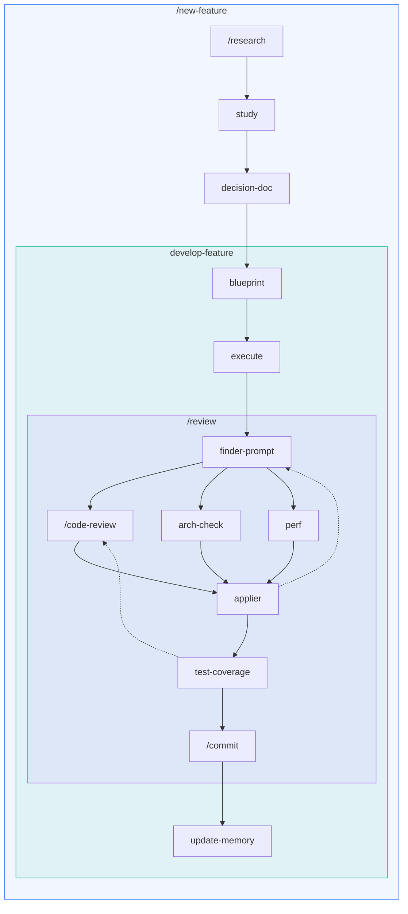

# README tecnico del pacchetto — rimosso il 21 settembre 2026

Il `plugins/daiku/README.md` era diventato un manuale tecnico (guida alle skill, guardrail,
modello mentale, catene, riferimento skill). Il 21 settembre 2026 è stato riscritto come vetrina
di presentazione: badge, intro non tecnica, installazione, mappa dei soli punti di ingresso.

**Perché:** un README di pacchetto lo legge chi deve decidere se installare, non chi ci lavora
dentro — il dettaglio tecnico spaventava e duplicava ciò che hanno già una sede.
**Sostituito da:** il nuovo `plugins/daiku/README.md` di presentazione.
**Contenuto normativo:** nessuna regola è andata persa — il ciclo di review vive in
`skills/review/SKILL.md`, la ripresa dalla cartella in `skills/new-feature/SKILL.md`, i ruoli e
la delega in `contracts/orchestration.md`, i parametri in `contracts/project-contract.md`, i
guardrail in `hooks/README.md`. Qui sotto resta il racconto d'insieme, che una sede propria non
ce l'aveva.

Qui sotto il testo **verbatim** al momento della rimozione.

---

# Comandi — guida alle skill

Questa cartella contiene i **contratti canonici** delle skill del progetto. Una skill, un
contratto, ogni host.

**Non tutti si lanciano.** I sette che si invocano a mano si scrivono `/<nome>` — per esempio
`/new-feature` — e un host che per invocarli richiede un pointer lo trova sotto
`{hosts.<host>.skill_pointers}`, che rimanda qui. Gli altri sono **contratti interni**: un
subagent li riceve come path da leggere, e qui sotto si nominano senza la barra, perché non c'è
niente da digitare. Quali siano gli uni e gli altri lo dichiara `contracts/orchestration.md` §3.

## Parametri

Ogni chiave fra graffe che compare in una skill si risolve sui due file di parametri —
`.daiku/project.json` nel progetto e `~/.daiku/environment.json` nella home dell'owner — mai a
memoria e mai per assunzione. Le regole
stanno nella §5 di `contracts/project-contract.md`, che dice anche in quale lingua una skill
scrive e cosa fare quando una chiave non c'è.

## I guardrail (il pacchetto non porta solo skill)

Oltre alle skill, Daiku installa **tre hook**. Vale la pena saperlo prima di installarlo, perché
uno dei tre può negare un comando:

| Hook | Quando | Cosa fa |
|---|---|---|
| guardia sui comandi | prima di ogni comando di shell | nega cinque gesti distruttivi |
| controlli sul corpus | dopo una scrittura | segnala i guasti che non fallirebbero da soli, per esempio un frontmatter di `SKILL.md` che si svuota in silenzio |
| stato del progetto | all'avvio di una sessione | dice se Daiku è aperto a metà e se un lavoro è rimasto in volo |

Due cose li governano, e sono la ragione per cui installarli non cambia come lavori:

- **Su un progetto senza `.daiku/` la guardia non nega niente.** Un pacchetto è attivo su ogni
  repository che l'host apre; un guardrail che negasse comandi a chi non ha aperto Daiku sarebbe
  un guasto, non una tutela.
- **Un solo diniego è dichiarato dal progetto**: le rimozioni dentro i worktree che
  `.daiku/project.json` dichiara in `worktree.pool`. Appena installato non è acceso niente, e
  `/init` non lo accende al posto tuo.

Tutto il resto è negato sempre, senza chiave: una rimozione ricorsiva che attraversa una
**junction di Windows** — non è una policy ma un fatto del sistema, `rm -rf` entra nel link e
svuota la directory reale dall'altra parte, e dalla riga di comando non si vede — ogni commit
che contiene **`.daiku/`** — il repository è del cliente e non vede nulla del metodo — e ogni
**`git push`** e ogni commit con **`--no-verify`**: a un agente non si lascia mai nessuna di
queste libertà.

I tre hook girano con **Node**, senza dipendenze da installare. Dove `node` non è nel `PATH` non
partono, e siccome non fermano mai un turno il risultato è che tacciono.

`hooks/README.md` porta il dettaglio: la tabella dei rami, il contratto fail-open, i banchi di
prova e come arrivano sui due host.

## Il modello mentale

Tre idee reggono tutto.

**1. Skill atomiche + skill orchestranti.** Le skill di base fanno *una* cosa (studia, progetta,
esegui, rivedi, committa). Le skill orchestranti (`/new-feature`, `develop-feature`, `/review`)
le incatenano nell'ordine giusto, delegando ogni fase
a un **subagent in contesto fresco**. L'orchestrazione è dell'agente: non c'è uno script che la
esegue al posto suo.

**2. Lo stato vive nei file, non nella chat.** Una feature nasce da una **cartella** di lavoro,
una per problema, sotto la cartella che `.daiku/project.json` dichiara alla chiave
`paths.studies`. Le skill leggono e scrivono file numerati dentro quella cartella,
così il lavoro sopravvive a interruzioni, compattazioni del contesto e passaggi di consegne:

| File | Cosa contiene |
|---|---|
| `0. problem.md` | il materiale grezzo del problema; se serve ancora pensiero strategico, `decision-doc` lo rifinisce qui |
| `0.5. studio-strategico.md` | la strategia **non** è ancora chiusa: verdetto e decisioni di direzione da chiudere con l'owner, con le risposte in coda quando arrivano |
| `1. decision-doc.md` | la strategia è chiusa: il problema studiato + le opzioni tecniche con trade-off |
| `2. blueprint.md` | il brief di esecuzione (piano a task, Memoria, Diario) |
| `3. memory-report.md` | l'esito dell'allineamento di memoria e documentazione: il blocco a contratto della fase 5b — i file toccati e le voci da confermare con l'owner |
| `4. review-notes.md` | cosa è stato fatto + il base-ref per la review |
| `5. review-report.md` | l'esito della review: il blocco a contratto e il path del suo ledger |

Chi riprende un lavoro **rilegge la cartella**, non la conversazione.

**3. I modelli non si nominano nelle skill.** Ogni passo dichiara un **ruolo** — `judge` o
`worker` — e `contracts/orchestration.md` è il punto unico che lo risolve nel modello dell'host
corrente. Cambiare quali modelli girano è una modifica a un solo file, e la tabella vive solo lì.

## Cosa lanci tu

Nell'uso normale, **un comando**:

```text
/new-feature <descrizione della feature o del problema>
```

Indagine sul codice, studio delle tecnologie che servono, documento di decisione, brief,
esecuzione, review a giri, aggiornamento di memoria e documentazione, commit: succede tutto
**dentro**, delegato a subagent. L'unico momento in cui intervieni è quando ti vengono **poste le
decisioni**: rispondi, e da lì fino al commit non tocchi più nulla.

**Se il lavoro è già cominciato non entri a metà catena: la catena è una sola, e la riapre
`/new-feature`.** Passargli la cartella che porta già materiale — appunti, requisiti, un
documento di decisione — gli fa saltare da sé i pezzi già fatti. Non esiste un `/decision-doc`
o un `/develop-feature` da lanciare a mano, ed è deliberato: due modi di arrivare allo stesso passo
sono due scope e due permessi da tenere allineati per sempre, e il secondo si erode in silenzio.

**Sono sette i comandi che si lanciano, e stanno in due gruppi.** Cinque sono il lavoro di ogni
giorno:

| Quando | Cosa lanci |
|---|---|
| comincia un lavoro, che ci sia già qualcosa sul disco o no | `/new-feature <descrizione o cartella>` |
| appunti su una tecnologia, fuori da una feature | `/research <libreria>` (deposita il file e si ferma) |
| hai un diff scritto a mano e vuoi la review | `/review` (senza argomenti: ciò che hai in mano nel perimetro del codice) |
| vuoi solo i bug di ciò che hai in mano, senza giri né fix | `/code-review [path...]` (un passaggio solo, esito in chat) |
| un diff da congelare, fuori da una review | `/commit` (senza argomenti: idem) |

Due si lanciano una volta per progetto, e girano **prima** che esista una catena:

| Quando | Cosa lanci |
|---|---|
| il progetto non ha ancora `.daiku/` | `/init` (prima di tutto il resto) |
| sei su Codex, o il pacchetto ha portato hook o ruoli nuovi | `/sync-host` (su Claude Code non serve: lo dice e si ferma) |

Tutto il resto — `decision-doc`, `develop-feature`, `update-memory`, `blueprint`, `execute`,
`arch-check`, `perf`, `test-coverage`, `finder-prompt`, `applier`, `study` — non si lancia: sono i
contratti che i sette aprono, e che un subagent riceve come path da leggere.

**Su un host che dichiara `{hosts.<host>.skill_pointers}`** sono invocabili le skill che hanno lì
il proprio pointer, e quali siano lo dichiara `contracts/orchestration.md` §3; un host che non
dichiara quella chiave carica i contratti direttamente da questa cartella.

## Catene

Chi apre chi. Con la barra le skill che si lanciano anche da sole, senza i contratti interni.
**Un riquadro colorato è una skill orchestrante, e dentro ci sono le sue fasi nell'ordine in cui
le apre** — una alla volta, ciascuna in un subagent con il contesto pulito.

La barra dice che quel contratto è anche un entry point, non che da solo faccia la stessa cosa:
`/research`, che qui è la raccolta che `new-feature` si procura, lanciato a mano deposita gli
appunti e si ferma. Chi invoca sceglie la modalità, e ogni nodo raggiungibile
in più di un modo le dichiara in casa propria.

**Gli entry point sono 7, e nel diagramma sono i nodi con la barra.** Cinque stanno nella
catena — `/new-feature`, `/research`, `/review`, `/code-review`, `/commit` — e due stanno fuori e nel diagramma
non compaiono: `/init` e `/sync-host` (apertura del progetto).



**Nessuna skill apre la successiva: le apre il riquadro che le contiene.** `blueprint` scrive il
brief e si ferma, `execute` lo esegue e deposita le note per la review, e nessuno dei due lancia
chi viene dopo — la sequenza è di `develop-feature`. È deliberato: un brief eseguito dal contesto
che l'ha scritto non è mai stato messo alla prova di essere autosufficiente.

L'unico punto che si apre in più rami è `finder-prompt`: i finder girano **insieme**, in subagent
che non si vedono fra loro, ed è l'unico vero parallelo del pacchetto. **Tre è il caso massimo,
non quello normale**: `bug` gira sempre, `arch` solo se il diff tocca un file coperto da una rule
di area, `perf` solo se tocca un percorso caldo — e dal secondo giro in poi resta `bug` da solo,
perché le altre due giudicano la forma del diff intero e si fanno una volta sola. Su un diff molto
grande succede l'opposto e `bug` si sdoppia in più finder per gruppi di file. Poi si riconverge su
`applier`, che è l'unico passo del ciclo che scrive. `decision-doc` gira due volte — studio, poi recepimento delle risposte dell'owner —
mentre il blocco `finder-prompt` → `applier` si ripete a ogni giro, finché il ciclo converge.

**Le due frecce tratteggiate sono i ritorni, e sono la ragione per cui la review è un ciclo e non
una passata.** La prima: i fix che `applier` ha appena scritto sono codice che nessun finder ha
visto, quindi il giro successivo li rivede — solo `bug`, solo sui file toccati — finché il ciclo
smette di trovarne. La seconda: se `test-coverage` ha scritto test, anche quelli sono codice che
nessuno ha letto, e parte un giro di chiusura su di essi, con l'`applier` in una modalità che
restringe lo scope ai soli file di test. Un test che passa non è un test corretto: può affermare
la cosa sbagliata.

`update-memory` compare una volta sola ma ha due strade: `/commit` lo delega sempre, ed è la
freccia che si vede; dentro la consegna gira **prima**, come fase propria, perché lì il commit
della review è soppresso e i commit li fa `develop-feature`.

### A. Il ciclo di vita di una feature

Da una descrizione fino al commit, in un'unica esecuzione:

```text
/new-feature "<descrizione>"
   → indagine sul codice → research (+ study) sulle tecnologie che servono → riconfronto
     → decision-doc → ⏸ le decisioni, poste in chat → recepimento
       → develop-feature (brief → esecuzione → review → commit → merge)
```

L'**unica pausa** è il punto ⏸: le decisioni arrivano come domande, con le opzioni già studiate e
una raccomandata. Rispondi — anche fuori dalle opzioni, e la tua risposta prevale — e la catena
riparte da sola. Se il problema è ancora immaturo le domande arrivano in due giri: prima la
direzione, poi la tecnica.

**Lo studio delle tecnologie non lo chiedi tu.** `/new-feature` guarda cosa il problema tocca e
decide da sé se la conoscenza del modello basta: una libreria giovane, una versione più recente
del suo cutoff o un framework che rilascia spesso valgono uno studio dalle fonti reali. Quando gli
appunti tornano, **il problema viene riscritto** su ciò che le fonti dicono davvero — prima che
qualcuno decida su di esso.

| Stadio | Cosa fa | Output |
|---|---|---|
| indagine | fan-out sul codice, un fronte per area | `0. problem.md` |
| `research` + `study` | appunti operativi su una tecnologia, dalle fonti reali | un md in `paths.lib_notes` |
| riconfronto | riscrive il problema su ciò che gli appunti smentiscono | `0. problem.md` rifinito |
| `decision-doc` | valuta lo stadio e studia le decisioni | `0.5. studio-strategico.md` oppure `1. decision-doc.md` |
| `develop-feature` | brief → esecuzione → review a giri → gate → memoria → commit → merge | il lavoro committato e `5. review-report.md` |

### A-bis. Fermarsi a ogni stadio

Gli stessi passi restano atomici e invocabili uno per uno, per quando vuoi guardare il lavoro fra
uno stadio e l'altro:

```text
/decision-doc → /blueprint → /execute → /review → /commit
```

| Step | Cosa fa | Output |
|---|---|---|
| `decision-doc` | valuta lo stadio: se manca ancora strategia, revisione scettica su `0. problem.md` + decisioni numerate; se la strategia è chiusa, studio tecnico approfondito | `0.5. studio-strategico.md` oppure `1. decision-doc.md`, con `0. problem.md` rifinito |
| `blueprint` | trasforma decisione + soluzione in brief | `2. blueprint.md` |
| `execute` | scrive il codice dal brief | `4. review-notes.md` |
| `/review` | qualità sul diff: giri di finder e fix finché converge → gate | — |
| `/commit` | allinea memoria/doc sul diff staged, poi committa | un commit per gruppo non vuoto, in ordine: codice, memoria/doc, versione/changelog |

- **`decision-doc`** accorpa i file di riferimento in `0. problem.md`, poi decide lo stadio: se
  restano decisioni strategiche aperte fa da senior scettico (rilievi citati + decisioni di
  direzione) e le deposita in `0.5. studio-strategico.md`; se la strategia è già chiusa produce
  `1. decision-doc.md` con le opzioni tecniche in cima. Le decisioni le **restituisce** a
  `/new-feature`, che è chi te le pone in chat, e al giro successivo recepisce le tue risposte
  nel documento che le ospita, accanto alla decisione che le ha chieste.
- **`blueprint`** produce `2. blueprint.md` e **si ferma lì**.
- **`execute`** esegue il brief in autonomia con verifiche mirate al perimetro toccato, deposita
  `4. review-notes.md`; il gate di build e test è di `/review`.
- **`/review <base-ref | 4. review-notes.md> [--with …]`** decide da sé, leggendo il diff, se
  arch-check/perf sono pertinenti: se il diff sono tanti file ma solo fix puntuali, quei finder
  non vengono nemmeno lanciati. La copertura la decide un worker dedicato dopo il ciclo, sul diff
  finale. Il finder bug gira sempre.
  Poi **itera**: i fix appena scritti sono codice che nessun finder ha visto, quindi il giro
  successivo li rivede, e il ciclo si ferma quando smette di trovarne. Il gate gira sempre, una
  volta all'uscita, e **il commit chiude il ciclo** salvo `--no-commit`.
- **`/commit`** allinea prima memoria e documentazione al diff staged — delegando **sempre** a
  `update-memory`, che è quello che decide se c'è qualcosa da scrivere — poi committa **un gruppo per commit**, in
  quest'ordine: il codice con il tipo appropriato, gli artefatti non-codice, e per ultimo versione e
  changelog quando il bump li tocca. Un gruppo vuoto non produce alcun commit.

Ogni step è **atomico e sequenziale**, e nessuno dei tre si lancia da sé: li apre `/new-feature`,
uno dopo l'altro, nell'ordine.

### B. La consegna — `develop-feature`

È la metà a valle della catena: dal decision-doc risolto fino al codice integrato, senza fermarsi
a ogni stadio. La apre `/new-feature`, quando le decisioni sono chiuse: **non si lancia a mano**, e riceve la cartella e
la soluzione scelta già risolte nel prompt.

Undici fasi: worktree, brief (`blueprint`), esecuzione (`execute`), review, decisione, stage,
memoria (`update-memory`), i tre commit, merge, pulizia, report. Solo quattro sono contratti di
altre skill, ed è la mappa in cima a dirlo; le altre sette sono sue.

La fase **Review** non è una copia: è `skills/review/SKILL.md` eseguito integralmente,
la stessa disciplina che gira da `/review` standalone (con `--no-commit`: qui il commit è una
fase successiva della consegna). Il commit è condizionale: solo a
gate verde e senza rilievi bloccanti, e in **commit distinti**, uno per gruppo non vuoto: prima il
codice, poi doc e memoria, per ultimo — solo se toccati — versione e changelog.

Quello che questa skill possiede in proprio, e che non vive in nessun altro contratto, è il **ciclo
di vita del worktree**: nessuna consegna lavora sull'albero principale, che vede solo il merge. Un
lavoro bloccato resta sul branch del suo worktree — non si parcheggia in una patch e non si
integra — e quel worktree esce dal pool finché l'owner non lo tratta.


## Come si orchestra (la parte che era in uno script)

Le skill orchestranti delegano ogni fase a un subagent, con cinque regole fisse
(`contracts/orchestration.md`):

| | Come funziona |
|---|---|
| **Chi decide il prossimo passo** | l'agente, turno per turno, leggendo il blocco di ritorno della fase precedente |
| **Output di un passo** | un **blocco JSON a contratto**, dichiarato nella skill: si legge quello, non la prosa. Se manca o è incompleto, il passo è fallito: si rilancia **una volta sola**, e cosa ne segue lo dichiara la skill che lo ospita |
| **Concorrenza** | fan-out parallelo di default (subagent lanciati nello stesso blocco di tool call); sequenziale sui backend a rate limit stretto, e sempre sequenziale per ciò che tocca la stessa working tree |
| **Ripresa** | dallo stato osservabile su file: artefatti numerati nella cartella, report append-only, `git log` |
| **Modello per passo** | dal ruolo dichiarato (`judge`/`worker`), risolto in `contracts/orchestration.md` §2 |

Fino a luglio 2026 le quattro catene giravano dentro il tool `Workflow` di Claude Code: legavano
il progetto a un solo host, mentre le skill devono poter girare identiche su ogni host. Quegli
script sono stati rimossi.

## Riferimento skill (una per una)

### Apertura del progetto
- **`/init [radice tecnica]`** — apre `.daiku/` su un progetto che non ce l'ha: `project.json`
  compilato con quello che il repository dichiara davvero, le due cartelle `domain/` e
  `policies/` con la loro convenzione e gli scheletri di dominio che il pacchetto porta già
  scritti, e `~/.daiku/environment.json` se sulla macchina non c'è. Su **Claude Code** porta anche
  la memoria dell'host dentro il repository — crea il corpus, ci sposta quello che l'agente aveva
  già scritto fuori, e aggancia la cartella in `.claude/settings.local.json`, che resta di quella
  macchina: le memorie si committano, il puntamento no, e su un clone si rilancia `/init`. Su
  **Codex** quel passo non c'è, perché lì la memoria dell'agente è un database nella home che non
  si sposta. **Chiede due cose e due sole**: in quale lingua vuoi
  la chat e in quale i commit — le uniche che il repository non può dirgli con certezza, e le
  propone guardando cosa ci trova. Non sovrascrive mai un file che esiste, quindi si rilancia
  senza danno quando il pacchetto porta uno scheletro nuovo, e quello che hai riscritto resta
  tuo. Chiude dichiarando cosa ha lasciato da compilare a mano: è la parte da leggere.
- **`/sync-host [radice tecnica]`** — porta dentro `.codex/` le due cose che un pacchetto Codex
  non può trasportare, perché il manifest le rifiuta entrambe: i tre guardrail e i ruoli di
  subagent. Degli hook copia i `.mjs`, lancia il banco di prova di ciascuno e aggancia **solo**
  quelli sani, poi scrive `.codex/hooks.json` con i path assoluti — un hook di Codex non riceve
  nessuna variabile che punti al progetto. Dei ruoli genera `.codex/agents/*.toml` dai file
  `agents/` del pacchetto, così `finder` si chiama allo stesso modo sui due host. Su Claude Code non c'è niente da fare e lo dichiara: lì li porta il pacchetto. Si rilancia
  a ogni aggiornamento; dopo, gli hook cambiati vanno riapprovati con `/hooks` dentro Codex.

### Studio e decisione
- **`/new-feature <descrizione o cartella>`** — apre la cartella di lavoro, indaga il codice, si
  procura la conoscenza che manca, fa studiare le decisioni e **te le pone in chat**; con le tue
  risposte prosegue fino al commit. È il comando con cui comincia un lavoro, che sul disco ci sia
  già qualcosa o no. Dentro apre `decision-doc` e `develop-feature`, che per questo non si
  lanciano da sé.
- **`/research [libreria/tecnologia]`** — studia una libreria dalle fonti reali (docs ufficiali,
  repo, package registry) e produce appunti operativi nella cartella che `paths.lib_notes`
  dichiara. Lanciata a mano **deposita il file e si ferma**: non apre niente a valle — il riordino
  lo fa `study`, contratto interno, sullo stesso file. Dentro una
  feature la decide `/new-feature`, senza chiedertelo.

### Qualità e manutenzione
- **`/review [base-ref | path a "4. review-notes.md"] [--rounds N] [--effort …] [--with arch-check,perf,test-coverage] [--no-commit]`**
  — ciclo di review su un diff, in due velocità che decide lui. Il **giro 1** è il fan-out: bug
  sempre attivo, arch-check/perf accesi dallo scope. I **giri successivi** rivedono i soli file
  toccati dai fix, con il solo finder bug, perché quei fix sono codice che nessuno ha ancora
  letto — ed è lì che si trovano le correzioni che ne rompono un'altra. Il numero di giri lo
  decide l'andamento (tre fix gravi ne impongono un altro, sotto decide il merito), guardrail a 6,
  ledger dei rilievi già scartati. Gate sempre, una volta all'uscita, poi **committa**,
  delegandolo a `/commit`: lo sopprime `--no-commit`, che passa chi committa da sé.
- **`/code-review [path...] [--effort …]`** — un passaggio solo-bug sullo scope che gli dici:
  niente fan-out, niente fix, niente commit. L'esito è in chat.
### I contratti interni — non si lanciano, li aprono i sette

Restano file sotto `skills/`, e un subagent li riceve come path da leggere. Sono elencati qui
perché è dove si va a vedere cosa fa un passo, non perché ci sia un comando da digitare.

- **`decision-doc`** — accorpa i file di riferimento in `0. problem.md`, valuta lo stadio del
  problema e produce `0.5. studio-strategico.md` o `1. decision-doc.md`, restituendo le decisioni
  a chi lo ha aperto. Lo apre `new-feature`, due volte: studio, poi recepimento delle risposte.
- **`develop-feature`** — la catena dal decision-doc risolto fino al commit: worktree, brief,
  esecuzione, review, allineamento, i tre commit, merge, report. La apre `new-feature`.
- **`blueprint`** — dal decision-doc più la soluzione scelta produce il brief `2. blueprint.md`
  e si ferma lì. Fase 1 di `develop-feature`.
- **`execute`** — esegue il brief, aggiorna Memoria e Diario mentre lavora, deposita
  `4. review-notes.md`. Fase 2 di `develop-feature`.
- **`update-memory`** — allinea il file di istruzioni, `.daiku/policies/`, il corpus di memoria e
  il documento tecnico al diff. Fase 5b di `develop-feature`, e il passo che `/commit` delega
  **a ogni invocazione, senza eccezioni**: non esiste una revisione del corpus a posteriori,
  perché il corpus resta sano passando di qui a ogni commit.
- **`arch-check`**, **`perf`** — le due discipline condizionali di un giro di review.
- **`test-coverage`** — la fase Copertura dopo il ciclo.
- **`finder-prompt`**, **`applier`** — il prompt di un finder e l'applicatore dei suoi rilievi.
- **`study`** — riordina il file sporco di appunti raccolto da `research`, senza perdere un fatto
  verbatim, e restituisce il blocco di ritorno. Lo apre `research`, a ogni invocazione.

### Git
- **`/commit`** — committa le modifiche fatte nella chat corrente, senza mai fare push. Decide se
  il diff staged giustifica un allineamento di memoria e documentazione e in tal caso lo delega a
  `update-memory`; codice, artefatti non-codice e versione/changelog finiscono in **commit
  distinti** — fino a tre, in quest'ordine, e solo per i gruppi non vuoti.
