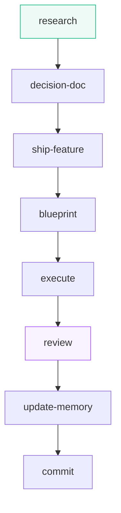
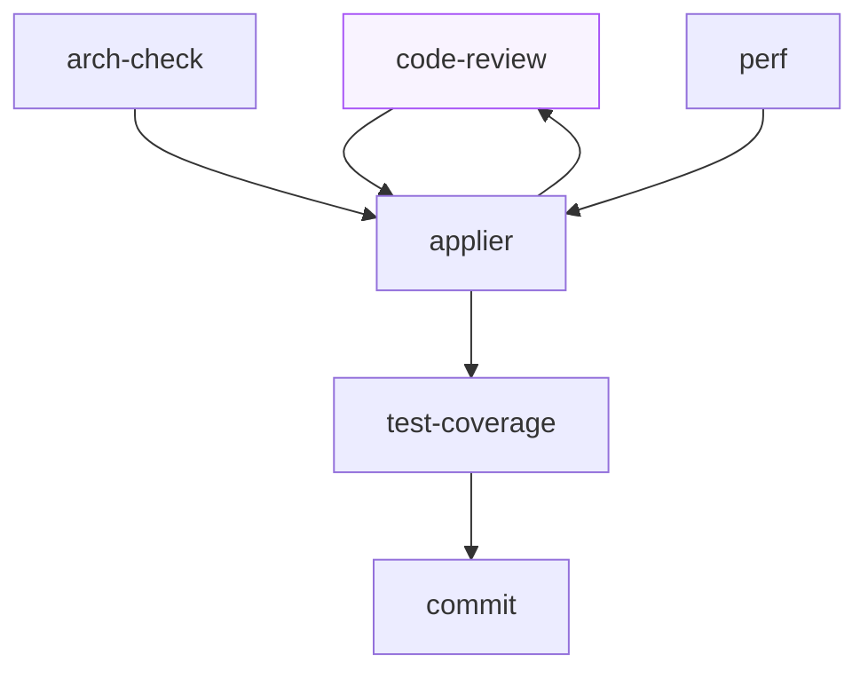

<p align="center">
  
</p>

<h1 align="center">Daiku</h1>

<p align="center">
  <i>Growing a project in the right direction.</i>
</p>

<p align="center">
   <br>
  <a href="https://code.claude.com"></a>
  <a href="https://developers.openai.com/codex"></a>
</p>

> A bonsai does not grow at random: it grows in the right direction because somebody decided
> the shape, guides the branches and prunes where needed — patiently, one intervention
> after another.
>
> Daiku does the same with your software. AI agents work fast and autonomously, but
> **inside the architectural constraints you decided** — and Daiku forces them to respect
> those constraints. Every contribution is checked, pruned,
> re-checked. That way the project grows, feature after feature, **without losing its
> shape**. Available for **Claude Code** and **Codex**.

## Why you will like it

- **The workflow has an engine, not a prompt.** A program — the evaluator — owns the order of the
  chain: given the entry point and what already exists on disk it answers which steps remain, and
  **its verdict binds**. No phase gets skipped, reordered or declared finished by the agent itself:
  if the evaluator does not answer, the delivery stops instead of quietly degrading.
- **Review is a cycle that converges, and it keeps a ledger.** Round one fans out independent
  reviewers who read the same diff without seeing each other — bugs always, architecture, performance
  and dead code only where the diff calls for them. Their fixes are new code nobody has read, so the
  next round re-reviews exactly those, and so on until the code stops changing. Every finding already
  judged sits in a ledger and is never raised twice; one full compile-and-test gate runs a single
  time, at the end.
- **Skills are behaviour only.** The method's files are byte-identical on every project: they say
  *what* is done and *in what order*, never with which values. Paths, gates and commands live one
  level down in `.daiku/` — a gate is the exact line plus the directory to run it from, never a
  description — so the same Daiku works on your stack without a single skill edited.
- **Decisions come to you already studied.** At a real fork it asks, with two to four mutually
  exclusive options and one of them recommended, and nothing else moves while it waits — no subagent
  is still in flight when the question reaches you. You answer, and the chain resumes alone from there
  down to the commit.

## How to start

**1. Install it** — once, on your host:

```text
# Claude Code
claude plugin marketplace add NicolaTomasoni/daiku
claude plugin install daiku@daiku

# Codex
codex plugin marketplace add NicolaTomasoni/daiku
codex plugin add daiku@daiku
```

It needs **Node.js 18 or later**. Without it the six hooks stay silent and the evaluator does not
start at all: since its verdict binds, a delivery stops instead of degrading.

**2. Open it on a project** — once per project, from the project's **technical root**: the folder
carrying your instructions file, which is the repository root unless the code lives in a subfolder.

```text
/init
```

It asks only two things — the language for the chat and the one for commits — then writes
everything in one run and answers `You're all set.` What your repository does not declare it leaves
out, and the skills know how to work without it. On Codex it also installs protections and roles by
itself. On Claude Code it leaves updates in place too: an update script and a VS Code task,
`daiku: update` — run it from the editor and it shows you the version in place and asks before
moving on.

**3. On Codex only**, re-run after every update:

```text
/sync-host
```

It realigns protections and roles inside the project (on Claude Code there is nothing to do). Its
last block is the one you must not skip: four gestures Codex asks of you — approve the changed
hooks, trust the project, declare the pool, reopen the session. Skip them and Codex reports a clean
install while no guardrail is active.

## The commands, from simplest to largest

Three commands for everyday work, ordered by size: `/research` procures
knowledge, `/review` checks a diff, `/new-feature` goes from an idea to the commit by orchestrating
everything else. Beside them, `/new-project` is launched once, on a project that has just run
`/init`: it writes the five founding documents — `PRODUCT.md`, `BRAND.md`, `DOMAIN.md`, `STACK.md`
and `ARCHITECTURE.md` — from the package skeletons, at the paths `.daiku/project.json` declares.

### `/research`

When the model lacks knowledge — a young library, a version released after its
cutoff — it studies it from the real sources: documentation, repositories, registries. Collection
runs on several fronts in parallel; then `study` tidies the notes and deposits them in a file.
Run by hand, the file is the delivery; inside a feature it is invoked as needed.

### `/new-feature` — from description to commit

The command every job starts with. You tell it the idea in natural language — or hand it a folder already opened, and it resumes from there: the documents it finds are the state, so nothing already written is written again, and the decisions left unanswered come back to ask, each with the place it has in that document's list. Starting from a description, it first investigates the code and puts the problem down in black and white; when knowledge is missing, it relies on `/research`.

Then `decision-doc` studies the options and comes to ask its questions, with a recommended answer: you answer and it records, until every decision is closed.

At that point, `ship-feature` takes over delivery: `blueprint` writes the work plan, `execute` runs it, `/review` checks it, `update-memory` aligns memory and documentation, and `commit` closes the feature. It always works in a separate worktree, merged and cleaned at the end.



### `/review`

You hand it hand-written code and the quality check starts. First it looks at what
changed and re-reads findings discarded in the past, so as not to raise them again. Then round one:
three independent reviewers read the same code without seeing each other — bugs always,
architecture and performance only when the diff touches them. Then `applier` applies the
fixes; and since those are code nobody read yet, the next round re-checks only the
touched files, until nothing is left to find. At that point `test-coverage` writes the missing
tests, one full compile-and-test verification runs a single time, and `commit`
closes. If you prefer committing yourself, the cycle stops at the report.



Two pieces also stand alone: `/code-review` runs the bug-only cycle on the scope you name —
fixes, re-checks and the gate — and stops at the report, leaving the commit to you; `/commit`
tidies memory and documents and closes in separate commits.

## About me

I am one developer. I build software in the industry, and I spend my days inside very large
codebases: corporate projects that reach millions of lines, that were not written yesterday and
that cannot be stopped.

Daiku is not a method designed at a desk and then tried somewhere: it grew, one intervention after
another, out of successive refinements on those projects. That is where every rule in it comes from,
and why it assumes from the first minute a codebase far larger than a demo — and already running.
It is meant to be adopted the way it was born: gradually, feature after feature, without ever
stopping the project.

## Inspirations

Daiku stands on the shoulders of public work that explored the same space before it:

- [everything-claude-code](https://github.com/WorldFlowAI/everything-claude-code) — a Claude Code toolkit of agents, commands, skills, rules and hooks, studied in a full repo confrontation: E2E journeys with flaky quarantine, security defect classes, the dead-code discipline, policy-guided source hygiene, open-ledger reminders and the host-manifest bench all came from there.
- [superpowers](https://github.com/obra/superpowers) — an agentic skills framework and software development methodology.
- [ponytail](https://github.com/DietrichGebert/ponytail) — a minimal-code ruleset pushing agents toward the smallest change that works.
- [agent-skills](https://github.com/addyosmani/agent-skills) — a production-grade pack of twenty-five skills spanning the whole DEFINE→SHIP cycle across a dozen agents, studied in a full repo confrontation: a deterministic eval of skill routing with a ratchet, a linter over the skill corpus and a diff-scoped floor-guard against a lowered quality bar are its most transferable mechanisms.
- [andrej-karpathy-skills](https://github.com/multica-ai/andrej-karpathy-skills) — a single-file behavioural preamble for coding agents, from Andrej Karpathy's notes on how LLM agents write code: studied in a full repo confrontation, its four conduct rules turned out to be, in substance, the ones Daiku already carries in the project instructions file.
- [token-optimizer](https://github.com/alexgreensh/token-optimizer) — a model-free context optimizer for coding hosts: compression functions, fill-threshold checkpoints and post-compact restore from a local SQLite state, with no network calls.
- [compaction](https://github.com/philipppohlmann/compaction) — a local token-reduction layer under Claude Code, Codex and Cursor: output shaping before generation, byte-exact recovery of every mutated request, and a boundary that fails open on any error.
