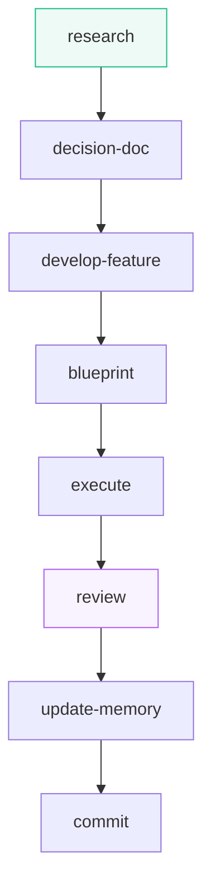
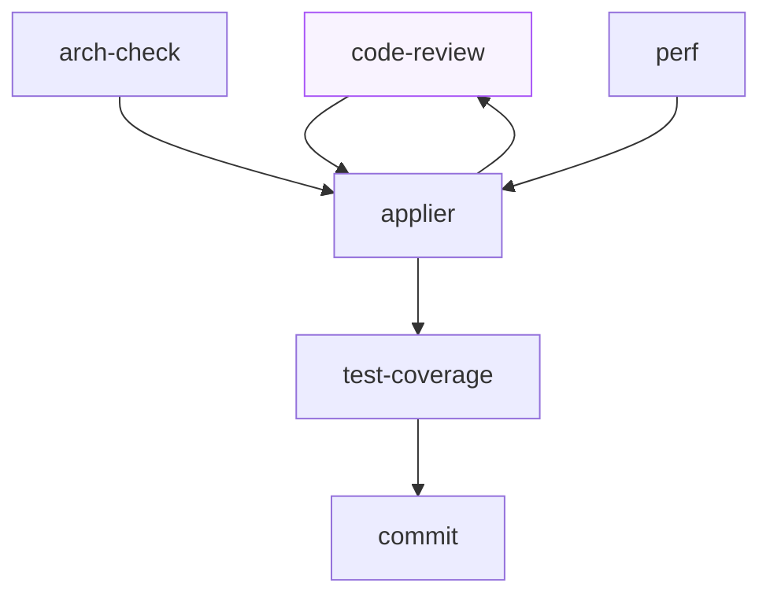

<p align="center">
  
</p>

<h1 align="center">Daiku</h1>

<p align="center">
  <i>Growing a project in the right direction.</i>
</p>

<p align="center">
   <br>
  <a href="https://code.claude.com"></a>
  <a href="https://developers.openai.com/codex"></a>
</p>

> A bonsai does not grow at random: it grows in the right direction because somebody decided
> the shape, guides the branches and prunes where needed — patiently, one intervention
> after another.
>
> Daiku does the same with your software. AI agents work fast and autonomously, but
> **inside the architectural constraints you decided** — and Daiku forces them to respect
> those constraints, not merely suggest them. Every contribution is checked, pruned,
> re-checked. That way the project grows, feature after feature, **without losing its
> shape**. Available for **Claude Code** and **Codex**.

## Why you will like it

- **You decide the shape.** You declare the project's constraints once — architecture, rules,
  conventions — and from then on every AI agent works inside them. Not advice in the wind:
  checks that really fire.
- **Automatic pruning.** Every job goes through multi-round checks: bugs, architecture,
  performance, tests. What grows crooked gets corrected, and corrections get
  re-checked until nothing is left to fix.
- **You narrate, you do not configure.** You describe the idea in natural language: code investigation,
  technology study, design, execution — it handles the rest, inside the shape you
  traced.
- **Forks stay yours.** When there is a real decision it asks you, with options already
  studied and one recommended. You answer and it restarts alone, down to the commit.
- **Nothing gets lost.** Every job lives in a folder of files, not in chat
  memory: you can interrupt, close everything, resume in a week — it re-reads the files
  and restarts where it left off. And what is learned by working stays versioned together
  with the code, and does not vanish with the session.
- **Silent guards.** Three small checks protect you from costly distractions
  (a push fired by mistake, a commit skipping the checks) without ever bothering you:
  on a project not using Daiku they do not even stir.

## How to start

**1. Install the plugin** — once, on your host:

```text
# on Claude Code, from the chat:
/plugin marketplace add <marketplace-address>
/plugin install daiku@daiku

# on Codex, from the terminal:
codex plugin marketplace add <marketplace-address>
codex plugin add daiku@daiku
```

> The final marketplace address arrives with Daiku's first public release.
> Meanwhile install from the repository's local checkout (both hosts accept it).

Only requirement: **Node.js**. Without it the five protection hooks stay silent, and the method's
evaluator does not start at all: its verdict binds, so a delivery stops there instead of degrading.

**2. Open it on your project** — once per project, from the repository root:

```text
/init
```

It asks only two things — which language for the chat and which for commits — and prepares
everything else alone. What it cannot guess it lists at the end: the only part
worth reading carefully.

**3. If you are on Codex**, after every package update re-run:

```text
/sync-host
```

It realigns protections and roles inside the project (on Claude Code no need: the
package carries them and they update alone). Then approve changed hooks with `/hooks` inside Codex.

## Skills are behaviour only

Skills stay identical on every project: they say *what* is done and *in what order*,
never *with which values*. Anything project-specific lives one level down:

- `.daiku/project.json` — paths and literal commands (gates, fixers, coverage, changelog,
  version file). A gate is the exact line plus its cwd, never a description.
- `~/.daiku/environment.json` — host, model per role, backends, machine paths.
- `.daiku/domain/` — local judgement: conventions and criteria that need a *why*.
- `.daiku/policies/` — architectural rules valid only for certain paths.
- memory and `tech_doc` — facts not deducible from the code: decisions and whys.

If a key is missing, the skill does not invent it: it skips that part and declares it.
An incomplete JSON makes a skill do less, not do wrong.

## How the contracts cite each other

A contract never writes an absolute path: the package is copied verbatim into each host's cache,
and that folder changes at every update. Two forms, and only two:

- **to another contract's file** — the path relative to the package root: `skills/review/SKILL.md`,
  `contracts/orchestration.md`;
- **to a skill** — its name with a slash: `/review`, `/commit`, `/init`.

The slash form is a name, not a path: it carries no host, no namespace and no installation folder,
and it is the same on both hosts, so no contract has to know which one it is running on. Each host
resolves that name its own way.

## If you start from an almost-empty project

This is the normal case, not an error:

1. `/init` on an empty repo leaves the unknowable keys out and lists them in its
   *To fill in* block — the most important part of its report.
2. Define stack and language with the agent, then re-run `/init` from the same root.
   It runs in completion mode: it never overwrites, it writes only the missing pieces.
   That is how `project.json` evolves when the project takes shape — `update-memory`
   never touches it.
3. Then run `/new-feature`: it now reads the real values.

There is no hook keeping parameters up to date on every commit: hooks never write to
disk by design. Continuous alignment already exists as delegation — every `commit`
delegates to `update-memory`, which aligns instructions, policies, memory and tech doc
on the staged diff with two brakes: no unjustified update, minimum delta. Returning
`updated: false` is the expected outcome, not a failure.

## The commands, from simplest to largest

Three commands for everyday work, ordered by size: `/research` procures
knowledge, `/review` checks a diff, `/new-feature` goes from an idea to the commit by orchestrating
everything else.

### `/research`

When the model lacks knowledge — a young library, a version released after its
cutoff — it studies it from the real sources: documentation, repositories, registries. Collection
runs on several fronts in parallel; then `study` tidies the notes and deposits them in a file.
Run by hand, the file is the delivery; inside a feature it is invoked as needed.

### `/new-feature` — from description to commit

The command every job starts with. You tell it the idea in natural language — or hand it the folder where you already collected material, and it resumes from there. First it investigates the code and puts the problem down in black and white; when knowledge is missing, it relies on `/research`.

Then `decision-doc` studies the options and comes to ask its questions, with a recommended answer: you answer and it records, until every decision is closed.

At that point, `develop-feature` takes over delivery: `blueprint` writes the work plan, `execute` runs it, `/review` checks it, `update-memory` aligns memory and documentation, and `commit` closes the feature. It always works in a separate worktree, merged and cleaned at the end.



### `/review`

You hand it hand-written code and the quality check starts. First it looks at what
changed and re-reads findings discarded in the past, so as not to raise them again. Then round one:
three independent reviewers read the same code without seeing each other — bugs always,
architecture and performance only when the diff touches them. Then `applier` applies the
fixes; and since those are code nobody read yet, the next round re-checks only the
touched files, until nothing is left to find. At that point `test-coverage` writes the missing
tests, one full compile-and-test verification runs a single time, and `commit`
closes. If you prefer committing yourself, the cycle stops at the report.



Two pieces also stand alone: `/code-review` runs a single bug pass with the outcome in
chat; `/commit` tidies memory and documents and closes in separate commits.

## Inspirations

Daiku stands on the shoulders of public work that explored the same space before it:

- [everything-claude-code](https://github.com/WorldFlowAI/everything-claude-code) — a Claude Code toolkit of agents, commands, skills, rules and hooks, studied in a full repo confrontation: E2E journeys with flaky quarantine, security defect classes, the dead-code discipline, policy-guided source hygiene, open-ledger reminders and the host-manifest bench all came from there.
- [superpowers](https://github.com/obra/superpowers) — an agentic skills framework and software development methodology.
- [ponytail](https://github.com/DietrichGebert/ponytail) — a minimal-code ruleset pushing agents toward the smallest change that works.
