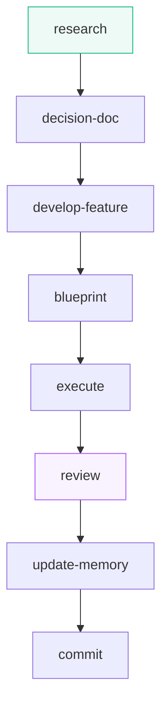
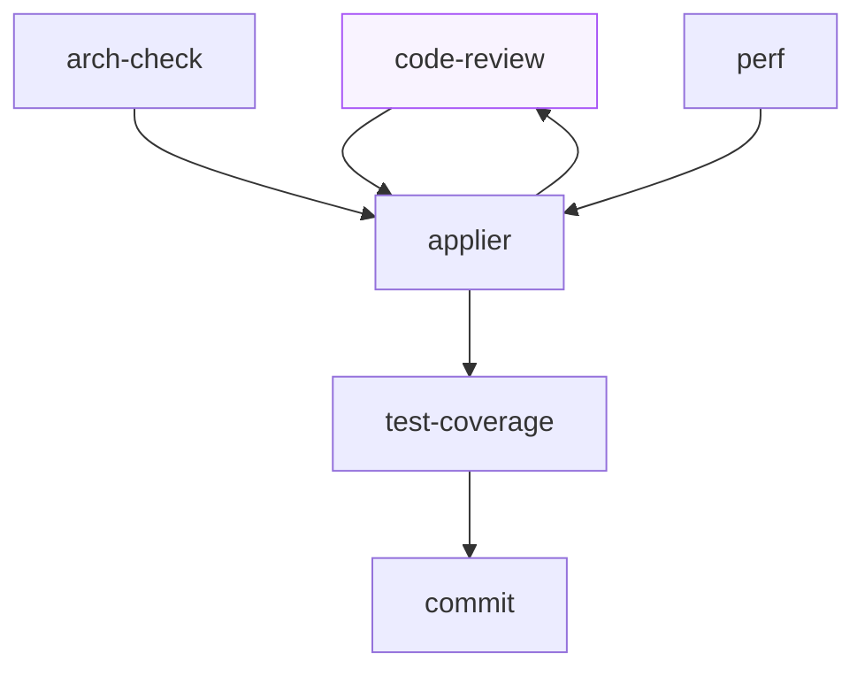

<p align="center">
  
</p>

<h1 align="center">Daiku</h1>

<p align="center">
  <i>Far crescere un progetto nella giusta direzione.</i>
</p>

<p align="center">
   <br>
  <a href="https://code.claude.com"></a>
  <a href="https://developers.openai.com/codex"></a>
</p>

> Un bonsai non cresce a caso: cresce nella direzione giusta perché qualcuno ha deciso
> la forma, guida i rami e pota dove serve — con pazienza, intervento dopo intervento.
>
> Daiku fa lo stesso con il tuo software. Gli agenti AI lavorano veloci e in autonomia, ma
> **dentro i vincoli architetturali che hai deciso tu** — e Daiku li obbliga a rispettarli, non
> li suggerisce e basta. Ogni contributo viene controllato, potato, ricontrollato. Così il
> progetto cresce, feature dopo feature, **senza perdere la forma**. Disponibile per
> **Claude Code** e **Codex**.

## Perché ti piacerà

- **La forma la decidi tu.** Dichiari una volta i vincoli del progetto — architettura, regole,
  convenzioni — e da quel momento ogni agente AI ci lavora dentro. Non sono consigli nel vento:
  sono controlli che scattano davvero.
- **Potatura automatica.** Ogni lavoro passa da controlli a più giri: bug, architettura,
  prestazioni, test. Ciò che cresce storto viene corretto, e le correzioni vengono
  ricontrollate finché non resta niente da sistemare.
- **Racconti, non configuri.** Descrivi l'idea in linguaggio naturale: indagine sul codice,
  studio delle tecnologie, progetto, esecuzione — al resto pensa lui, dentro la forma che
  hai tracciato.
- **I bivi restano tuoi.** Quando c'è una decisione vera ti fa la domanda, con le opzioni già
  studiate e una consigliata. Rispondi e lui riparte da solo, fino al commit.
- **Niente si perde.** Ogni lavoro vive in una cartella di file, non nella memoria della
  chat: puoi interrompere, chiudere tutto, riprendere fra una settimana — lui rilegge i file
  e riparte da dove era rimasto. E quello che si impara lavorando resta versionato insieme
  al codice, non svanisce con la sessione.
- **Guardie silenziose.** Tre piccoli controlli ti proteggono dalle distrazioni costose
  (un push partito per sbaglio, un commit che salta i controlli) senza mai darti fastidio:
  su un progetto che non usa Daiku non si fanno nemmeno sentire.

## Come si comincia

**1. Installa il plugin** — una volta sola, sul tuo host:

```text
# su Claude Code, dalla chat:
/plugin marketplace add <indirizzo-del-marketplace>
/plugin install daiku@daiku

# su Codex, dal terminale:
codex plugin marketplace add <indirizzo-del-marketplace>
codex plugin add daiku@daiku
```

> L'indirizzo definitivo del marketplace arriva con la prima uscita pubblica di Daiku.
> Nel frattempo si installa dal checkout locale del repository (entrambi gli host lo accettano).

Unico requisito: **Node.js** — e serve solo alle guardie di protezione, nient'altro da installare.

**2. Aprilo sul tuo progetto** — una volta per progetto, dalla radice del repository:

```text
/init
```

Ti chiede solo due cose — in che lingua vuoi la chat e in che lingua i commit — e prepara
tutto il resto da solo. Quello che non può indovinare te lo elenca alla fine: è l'unica parte
da leggere con attenzione.

**3. Se sei su Codex**, dopo ogni aggiornamento del pacchetto rilancia:

```text
/sync-host
```

Riallinea le protezioni e i ruoli dentro il progetto (su Claude Code non serve: li porta il
pacchetto e si aggiornano da soli). Poi approva gli hook cambiati con `/hooks` dentro Codex.

## I comandi, dal più semplice al più grande

Tre comandi per il lavoro di tutti i giorni, in ordine di grandezza: `/research` procura
conoscenza, `/review` controlla un diff, `/new-feature` va da un'idea al commit orchestrando
tutto il resto. 

### `/research`

Quando al modello manca una conoscenza — una libreria giovane, una versione uscita dopo il suo
cutoff — se la studia dalle fonti vere: documentazione, repository, registry. La raccolta
avviene su più fronti in parallelo; poi `study` riordina gli appunti e li deposita in un file.
Lanciato a mano, il file è la consegna; dentro una feature viene invocato al bisogno.

### `/new-feature` — dalla descrizione al commit

È il comando con cui comincia ogni lavoro. Gli racconti l'idea in linguaggio naturale — o gli passi la cartella dove hai già raccolto materiale, e lui riprende da lì. Prima indaga il codice e mette il problema nero su bianco; se gli manca una conoscenza, si affida a `/research`. 

Poi `decision-doc` studia le opzioni e viene a farti le domande, con una risposta consigliata: rispondi e lui recepisce, finché ogni decisione è chiusa. 

A quel punto, `develop-feature` prende in mano la consegna: `blueprint` scrive il piano di lavoro, `execute` lo esegue, `/review` lo controlla, `update-memory` allinea la memoria e la documentazione e `commit` chiude la feature. Lavora sempre in un worktree a parte, che alla fine viene fuso e pulito.



### `/review`

Gli affidi del codice scritto a mano e parte il controllo di qualità. Prima guarda cosa è
cambiato e rilegge i rilievi già scartati in passato, per non riproporteli. Poi il primo giro:
tre revisori indipendenti leggono lo stesso codice senza vedersi fra loro — i bug sempre,
l'architettura e le prestazioni solo quando il diff le tocca. Poi `applier` applica le
correzioni; e siccome sono codice che nessuno ha ancora letto, il giro dopo ricontrolla i soli
file toccati, finché non resta niente da trovare. A quel punto `test-coverage` scrive i test
che mancano, una verifica completa di compilazione e test gira una volta sola, e `commit`
chiude. Se preferisci committare da te, il ciclo si ferma al report.



Due pezzi si usano anche da soli: `/code-review` fa un passaggio solo sui bug con l'esito in
chat; `/commit` sistema memoria e documenti e chiude in commit separati.